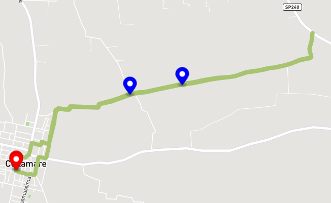

# [GPX VIEWER](https://manuelmanna.github.io/GPXViewer/) 
 
## Visualizza il tuo GPX in modo semplice e veloce 

### Utilizza [MapBox JS](https://www.mapbox.com) e [GPXParser JS](https://luuka.github.io/GPXParser.js/)

### <ins>**Al momento mostra un singolo gpx contenuto in `./static/gpx/example2.gpx`**</ins>

## Funzionalità
- Centra la mappa sulla posizione corrente
- Visualizzazione del tracciato `.gpx`
- Zoom della mappa in base al tracciato
- Marker di inizio e fine percorso
- Waypoint nel tracciato
- Popup dei waypoint (con titolo, url e descrizione)
- Colori del tracciato casuali

## Q&A
**Come inserisco un link all'iterno del titolo di un pop-up (nei waypoints)?**

Per farlo bisogna scrivere all'interno del `<cmt></cmt>` del file `.gpx` il link alla quale si vuole reindirizzare l'utente
s
## Bug
[✔️] **RISOLTO** ~~A volte è provabile che compari l'errore in console _`La mappa non è stata ancora caricata`_, in questo caso ricaricare la pagina e riprovare.~~

[❌] Il file gpx non deve contenere più di un `<trk>`, altrimenti mostrerà soltanto il primo

## Authors
- [Manuel Manna](https://github.com/manuelmanna)
- [Jonathan Caputo](https://github.com/jonnycp)